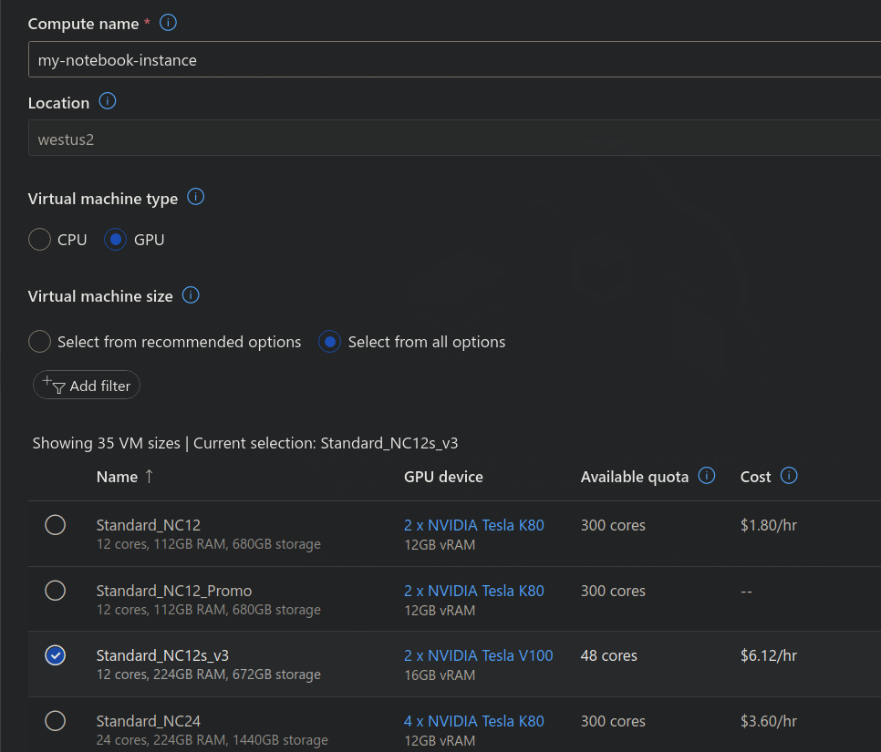
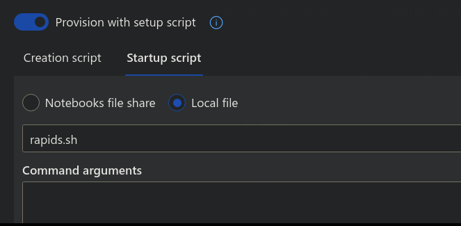

# Azure Machine Learning

RAPIDS can be deployed at scale using [Azure Machine Learning Service](https://learn.microsoft.com/en-us/azure/machine-learning/overview-what-is-azure-machine-learning) and easily scales up to any size needed.

## Azure ML Compute instance

You could install Azure Machine Learning on your local computer but it is recommended to create [Azure's ML Compute instances](https://learn.microsoft.com/en-us/azure/machine-learning/concept-compute-instance), a fully managed and secure development environment that can also serve as compute target for ML training. It comes with integrated Jupyter notebook server, JupyterLab, AzureML Python SDK and other tools.

### Pre-requisites

Use existing or create new Azure Machine Learning workspace through the [Azure portal](https://learn.microsoft.com/en-us/azure/machine-learning/how-to-manage-workspace?tabs=azure-portal#create-a-workspace), [Azure ML Python SDK](https://learn.microsoft.com/en-us/azure/machine-learning/how-to-manage-workspace?tabs=python#create-a-workspace), [Azure CLI](https://learn.microsoft.com/en-us/azure/machine-learning/how-to-manage-workspace-cli?tabs=createnewresources) or [Azure Resource Manager templates](https://learn.microsoft.com/en-us/azure/machine-learning/how-to-create-workspace-template?tabs=azcli).

Follow these high-level steps to get started:

**1. Create.** Create your Azure Resource Group.

**2. Workspace.** Within the Resource Group, create an Azure Machine Learning service Workspace.

**3. Config.** Within the Workspace, download the `config.json` file and verify that `subscription_id`, `resource_group`, and `workspace_name` are set correctly for your environment. You will load the details from this config file to initialize workspace for running ML training jobs from within your notebook.

**4. Quota.** Within your Workspace, check your Usage + Quota to ensure you have enough quota within your region to launch your desired cluster size.

### Select your instance

Sign in to [Azure Machine Learning Studio](https://ml.azure.com/) and navigate to your workspace. On the left side, select **Compute** > **+ New** and choose a [RAPIDS compatible GPU](https://medium.com/dropout-analytics/which-gpus-work-with-rapids-ai-f562ef29c75f) (NVIDIA Pascal or greater with compute capability 6.0+) as the SageMaker Notebook instance type (e.g., `Standard_NC12s_v3`)



### Provision RAPIDS setup script

Create a new "startup script" (via the 'Advanced Settings' dropdown) to install RAPIDS and dependencies. You can upload the script from your `Notebooks` files or local computer.
Optional to enable SSH access to your compute (if needed)



See the [Azure ML documentation](https://learn.microsoft.com/en-us/azure/machine-learning/how-to-customize-compute-instance) for more details on how to create the setup script but it should resemble:

```bash
#!/bin/bash

sudo -u azureuser -i <<'EOF'

conda create -y -n rapids {{ rapids_conda_channels }} {{ rapids_conda_packages }} ipykernel
conda activate rapids

# install Python SDK v2 in rapids env
python -m pip install azure-ai-ml azure-identity

# optionally install AutoGluon for AutoML GPU demo
# python -m pip install --pre autogluon

python -m ipykernel install --user --name rapids
echo "kernel install completed"
EOF
```

Launch the instance.

### Select the RAPIDS environment

Once your Notebook Instance is `Running` select "JupyterLab"

Then in JupyterLab select the `rapids` kernel when working with a new notebook

## Azure ML Compute cluster

Launch Azure's [ML Compute cluster](https://learn.microsoft.com/en-us/azure/machine-learning/how-to-create-attach-compute-cluster?tabs=python) to distribute your RAPIDS training jobs across single or multi-GPU compute nodes. The Compute cluster scales up automatically when a job is submitted, and executes in a containerized environment, packaging your model dependencies in a Docker container.

### Instantiate workspace

If using the Python SDK, connect to your workspace either by explicitly providing the workspace details or load from the `config.json` file downloaded in the pre-requisites section.

```python
from azure.ai.ml import MLClient
from azure.identity import DefaultAzureCredential

# Get a handle to the workspace
ml_client = MLClient(
    credential=DefaultAzureCredential(),
    subscription_id="<SUBSCRIPTION_ID>",
    resource_group_name="<RESOURCE_GROUP>",
    workspace_name="<AML_WORKSPACE_NAME>",
)

# or load details from config file
ml_client = MLClient.from_config(
    credential=DefaultAzureCredential(),
    path="path_to_config_file",
)
```

### Create AMLCompute

You will need to create a compute target using Azure ML managed compute (AmlCompute) for remote training. Note: Be sure to check limits within your available region. This [article](**link**) includes details on the default limits and how to request more quota.

`size`: The VM family of the nodes, specify compute targets from one of `NC_v2`, `NC_v3`, `ND` or `ND_v2` GPU virtual machines in Azure (e.g `Standard_NC12s_v3`)

`max_instances`: The max number of nodes to autoscale up to when you run a job

```{note}
You may choose to use low-priority VMs to run your workloads. These VMs don't have guaranteed availability but allow you to take advantage of Azure's unused capacity at a significant cost savings. The amount of available capacity can vary based on size, region, time of day, and more.
```

```python
from azure.ai.ml.entities import AmlCompute

gpu_compute = AmlCompute(
    name="gpu-cluster",
    type="amlcompute",
    size="STANDARD_NC12S_V3",
    max_instances=2,
    idle_time_before_scale_down=300,
    tier="low_priority",  # optional
)
ml_client.begin_create_or_update(gpu_compute).result()
```

### Upload data to Datastore

You can use existing dataset stored in Datastore bucket, or follow these quick steps to setup datastore

### Custom RAPIDS Environment

In Azure Machine Learning, the environment is used to define the necessary software dependencies (packages, libaries and settings) to run a training job.

When you create an AzureML experiment, you need to specify the environment that will be used to run copies of the training script across the cluster node. You can either use a pre-built environment provided by AzureML or create a custom environment by defining a Docker container image.

In this case, we would like to create a custom RAPIDS docker image. Simply specify the directory that will serve as the build context, which should contain a Dockerfile (similar to below) and any other necessary files:

```console
# Use rapids base image v23.02 with the necessary dependencies
FROM rapidsai/rapidsai:23.02-cuda11.8-runtime-ubuntu22.04-py3.10

# Update package information and install required packages
RUN apt-get update && \
    apt-get install -y --no-install-recommends build-essential fuse && \
    rm -rf /var/lib/apt/lists/*

# Activate rapids conda environment
RUN /bin/bash -c "source activate rapids && pip install azureml-mlflow azureml-dataprep"
```

Now you create the Environment:

```python
from azure.ai.ml.entities import Environment, BuildContext

env_docker_image = Environment(
    build=BuildContext(path="path_to_Dockerfile"),
    name="rapids-docker-image",
    description="Rapids training Environment",
)

ml_client.environments.create_or_update(env_docker_image)
```

### Test RAPIDS

Now that we have our environment and custom logic, we can configure and run `command` class to submit hyperparameter optimization tuning jobs. `inputs` is a dictionary of command-line arguments to pass to the training script. The code below demonstrates how to submit training job and hyper parameter sweeps.

Navigate to the [source/examples/rapids-azureml-hpo/notebook.ipynb](/examples/rapids-azureml-hpo/notebook) notebook for detailed instructions on how to do so.

```python
from azure.ai.ml import command, Input
from azure.ai.ml.sweep import Choice, Uniform, MedianStoppingPolicy


command_job = command(
        environment,
        experiment_name,
        code, # project_folder,
        command, # "python train_rapids.py --data_dir ${{inputs.data_dir}}...",
        inputs = {
                    'data_dir': Input(type="uri_file", path=data_uri),
                    ...
                  },
        compute="gpu-cluster",
    )


# submit the command
returned_job = ml_client.jobs.create_or_update(command_job)


# apply sweep parameter to obtain the sweep_job
sweep_job = command_job.sweep(
    compute="gpu-cluster",
    sampling_algorithm="random",
    primary_metric="Accuracy",
    goal="Maximize",
)

returned_sweep_job = ml_client.create_or_update(sweep_job)

```

### CleanUp

```python
# Delete amlcompute cluster
gpu_compute.delete()

# Delete Compute instance
ml_client.compute.begin_delete("compute_instance_name").wait()
```

```{relatedexamples}

```
